# MeetingMind — System Overview

<p align="center">
  
</p>

> **AI-powered meeting transcript analyser** that combines a custom-trained ML classification pipeline with LLM-based intelligence to extract actionable insights from meeting transcripts.

---

## Table of Contents

1. [Application Summary](#1-application-summary)
2. [Architecture Overview](#2-architecture-overview)
3. [Technology Stack](#3-technology-stack)
4. [Project Structure](#4-project-structure)
5. [Core Pipeline](#5-core-pipeline)
6. [Frontend Dashboard](#6-frontend-dashboard)
7. [Backend API](#7-backend-api)
8. [ML Classification Pipeline](#8-ml-classification-pipeline)
9. [AI Framing Layer](#9-ai-framing-layer)
10. [Data Flow](#10-data-flow)
11. [External Integrations](#11-external-integrations)
12. [Configuration & Environment](#12-configuration--environment)
13. [How to Run](#13-how-to-run)

---

## 1. Application Summary

**MeetingMind** is a AI meeting analysis application. Users upload meeting transcripts (PDF, DOCX, TXT, or raw text), and the system:

1. **Classifies** each sentence using a trained SVM model into five categories: *Decision*, *Task*, *Deadline*, *Issue*, or *General Discussion*.
2. **Refines** the ML output using an LLM (Gemini or Groq) to produce clean, professional insights — including participant detection, responsibility mapping, meeting title generation, and an intelligence score.
3. **Displays** everything in a premium, dark-themed dashboard with interactive visualizations, history tracking, AI summaries, Notion export, and multilingual support.

---

## 2. Architecture Overview

```
┌─────────────────────────────────────────────────────────────────┐
│                     FRONTEND (Streamlit, port 8501)             |             
│  meetingmind.html — Single-page app served via Streamlit        │
│  ┌───────────┬────────────┬─────────────┬──────────────────┐    │
│  │   Home    │  History   │ AI Summary  │    Settings      │    │
│  │ (Upload & │ (Past      │ (Generate   │ (Theme, Export,  │    │
│  │  Analyse) │  Meetings) │  summaries) │  Language)       │    │
│  └───────────┴────────────┴─────────────┴──────────────────┘    │
│  localStorage: meetingmind_history, meetingmind_settings        │
└─────────────────────────────┬───────────────────────────────────┘
                              │ HTTP (fetch)
                              ▼
┌─────────────────────────────────────────────────────────────────┐
│                   BACKEND (FastAPI, port 8502)                  │
│                                                                 │
|<<<<<<< HEAD                                                     |
│  POST /api/analyse       ← Full ML + AI pipeline                │
│  POST /api/extract_text  ← PDF/DOCX/TXT → plain text            │               
│  POST /api/export_notion ← Export insights to Notion            │
│  GET  /api/notion_status ← Check Notion connection              │
│  GET  /api/health        ← Health check                         │
│                                                                 │
│  ┌──────────────────┐    ┌──────────────────────────────────┐   │
|<<<<<<< HEAD         |    |                                  |   |
│  │  ML Pipeline     │───▶│  AI Framing Layer               │   │
│  │  (SVM + TF-IDF)  │    │  (Gemini → Groq → Fallback)      │   │
│  └──────────────────┘    └──────────────────────────────────┘   │
└─────────────────────────────────────────────────────────────────┘
                              │
                              ▼
┌─────────────────────────────────────────────────────────────────┐
│                   EXTERNAL SERVICES                             │
│  • Google Gemini API (gemini-2.0-flash) — Primary LLM           │
│  • Groq API (llama-3.3-70b-versatile) — Fallback LLM            │
│  • Notion API — Meeting export                                  │
│  • Google Translate Widget — UI translation                     │
└─────────────────────────────────────────────────────────────────┘
```

---

## 3. Technology Stack

| Layer         | Technology                                                    |
|---------------|---------------------------------------------------------------|
| **Frontend**  | Vanilla HTML/CSS/JS (single-file), embedded in Streamlit      |
| **Hosting**   | Streamlit (`app.py`) — wraps HTML as a full-screen component  |
| **Backend**   | FastAPI + Uvicorn (Python)                                    |
| **ML Model**  | scikit-learn (TF-IDF + Linear SVM with CalibratedClassifierCV)|
| **NLP**       | NLTK (tokenization, lemmatization, stopwords)                 |
| **AI/LLM**    | Google Gemini (`google-genai`), Groq (`groq`)                 |
| **File I/O**  | pdfplumber (PDF), python-docx (DOCX)                          |
| **Export**     | Notion API via httpx                                         |
| **Fonts**     | Google Fonts: Syne (headings), DM Sans (body)                 |
| **Theming**   | CSS custom properties with light/dark mode support            |

---

## 4. Project Structure

```text
MeetingMind/
├── .gitignore                   # Specifies intentionally untracked files to ignore
├── README.md                    # Project overview and setup instructions
├── app.py                       # Main Streamlit frontend application
├── config.py                    # Global configuration and environment settings
├── meetingmind.html             # Static HTML template or UI export
├── pyrightconfig.json           # Type-checking configuration for Pyright
├── requirements.txt             # Python package dependencies
├── github_raw_data/             # External research data (AMI, Google, MeetingBank) for creating labelled_data.csv
├── backend/                     # Backend services and machine learning pipeline
│   ├── __init__.py
│   ├── api/                     # FastAPI server and external integrations
│   │   ├── analysis_server.py   # API server handling backend requests
│   │   └── notion_export.py     # Handles exporting insights to Notion
│   └── ml_model/                # Custom ML classification pipeline
│       ├── __init__.py
│       ├── dataset/             # Dataset management
│       │   └── labelled_data.csv # The labelled dataset used for training
│       ├── inference/           # Scripts for making predictions
│       │   ├── __init__.py
│       │   └── predict_text.py  # Runs new text through the trained model
│       ├── models/              # Model definitions and vectorization
│       │   ├── __init__.py
│       │   ├── baseline_classifier.py # Linear SVM classifier definition
│       │   ├── model_utils.py   # Helper functions for the model
│       │   └── tfidf_vectorizer.py # Converts text into numerical TF-IDF features
│       ├── preprocessing/       # Text preprocessing logic
│       │   ├── __init__.py
│       │   └── text_cleaner.py  # Cleans and sanitizes input text
│       └── training/            # Scripts to train and evaluate the model
│           ├── __init__.py
│           ├── evaluate_baseline.py # Evaluates the model and generates metrics
│           ├── save_model.py    # Utility to save and load model artifacts
│           ├── train_baseline.py# The main training script
│           └── results/         # Saved evaluation plots and visualizations
│               ├── confusion_matrix.png
│               ├── label_distribution.png
│               ├── length_distribution.png
│               ├── per_class_metrics.png
│               ├── source_distribution.png
│               ├── word_clouds.png
│               └── wordcount_by_label.png
└── src/                         # Additional core Python modules
    ├── __init__.py
    ├── gemini_layer.py          # AI framing layer integrating Gemini/Groq
    └── insight_extractor.py     # Logic for extracting structured meeting insights
```


---

## 5. Core Pipeline

The analysis pipeline follows a three-stage architecture:

### Stage 1 — Text Extraction
- **File upload**: Frontend sends file to `POST /api/extract_text`
- **Text input**: Raw text sent directly
- Supports: PDF (pdfplumber), DOCX (python-docx), TXT (utf-8 decode)

### Stage 2 — ML Classification (`insight_extractor.py`)
- Splits transcript into sentences using NLTK `sent_tokenize`
- Each sentence is cleaned: lowercased → URLs removed → punctuation stripped → stopwords removed → lemmatized
- Sentences are vectorized using a pre-trained **TF-IDF vectorizer** (15K features, unigram + bigram)
- Classified by a **Calibrated Linear SVM** into one of 5 labels:
  - `Decision` — Key decisions made during the meeting
  - `Task` — Action items assigned to participants
  - `Deadline` — Time-bound commitments
  - `Issue` — Blockers, risks, or concerns
  - `General` — General discussion points
- Calculates an **intelligence score** (0–100) based on the volume and diversity of classified insights
- Returns structured dict with grouped sentences + metadata

### Stage 3 — AI Framing (`gemini_layer.py`)
- Takes the raw ML output and a detailed JSON-structured prompt
- Sends to **Gemini** (primary) → **Groq** (fallback) → **basic formatting** (last resort)
- The LLM refines and returns:
  - Clean, professional bullet points per category
  - **Participant names** extracted from transcript context
  - **Responsibility map** (participant → assigned tasks)
  - **Meeting title** (auto-generated)
  - **Intelligence score** with assessment
- Supports **multilingual output** — all text is generated in the user's selected language

---

## 6. Frontend Dashboard

The frontend is a single monolithic HTML file (`meetingmind.html`, ~4050 lines) containing all CSS, HTML structure, and JavaScript logic inline.

<table width="100%">
  <tr>
    <td width="50%" align="center">
      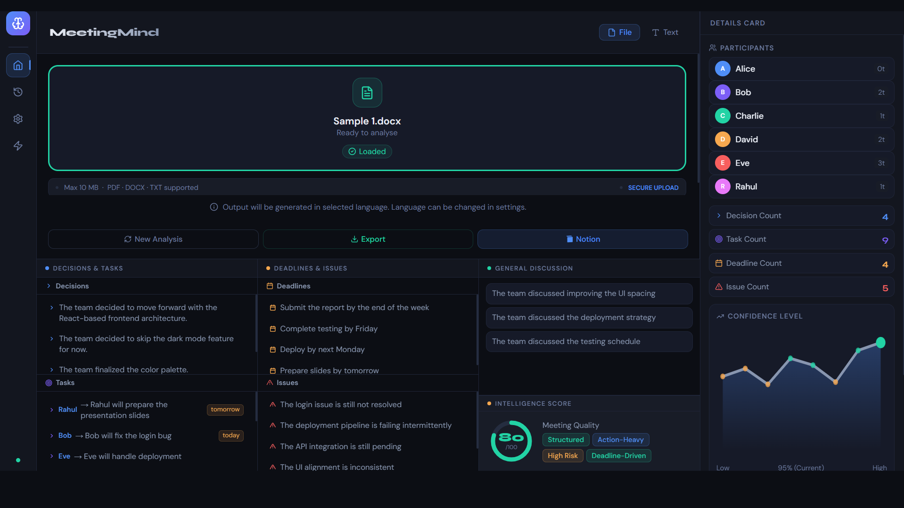
      <br><em>Home View — Analysis Results & Confidence Graph</em>
    </td>
    <td width="50%" align="center">
      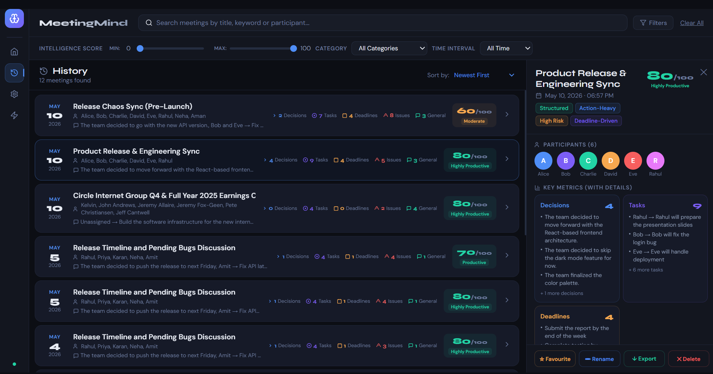
      <br><em>History View — Browse & Filter Past Meetings</em>
    </td>
  </tr>
  <tr>
    <td width="50%" align="center">
      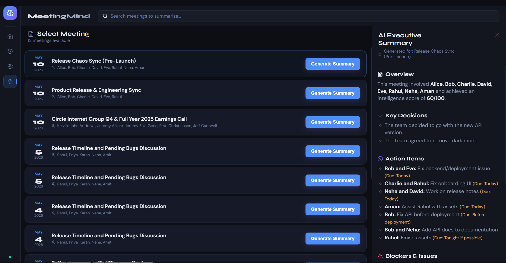
      <br><em>AI Summary — Auto-generated Executive Overview</em>
    </td>
    <td width="50%" align="center">
      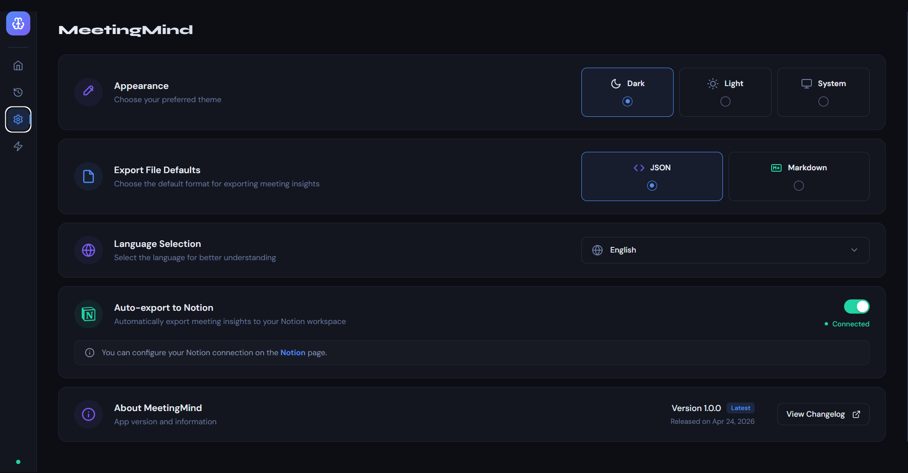
      <br><em>Settings — Preferences, Theme & Notion Export</em>
    </td>
  </tr>
</table>

### Navigation (Left Sidebar)
| Icon | Section | Description |
|------|---------|-------------|
| 🏠 | **Home** | Upload & analyse transcripts |
| 🕐 | **History** | Browse, search, filter past analyses |
| ⚙️ | **Settings** | Appearance, language, export preferences |
| ⚡ | **AI Summary** | Generate formatted summaries of past meetings |

### Home View
- **File upload zone**: Drag & drop or click to upload (PDF, DOCX, TXT; max 10 MB)
- **Text input tab**: Paste raw transcript text directly
- **Analysis pipeline indicators**: Visual step pills (Input Loaded → Classification → Entity Extraction → Report Generated)
- **Results display**: After analysis, shows:
  - Meeting title
  - Participant list
  - Categorized insights (Decisions, Tasks, Deadlines, Issues, General)
  - Responsibility map
  - Intelligence score
  - Confidence level (line graph visualization)
  - Quality tags (e.g., "Structured", "Action-Heavy", "High Risk")
- **Export buttons**: New Analysis, Export (JSON/MD), Notion export
- **Language note**: Indicates output will be generated in the selected language

### History View
- Split-pane layout: meeting list (left) + detail panel (right)
- Search bar + filters (Score, Category, Time)
- Meeting cards with date, title, participants, and score badge
- Detailed view shows all categorized insights
- Delete individual entries
- Data persisted in `localStorage` (`meetingmind_history`)

### AI Summary View
- Split-pane layout matching History
- Search bar for filtering meetings
- "Generate Summary" button on each meeting card
- Right panel shows AI-generated summary with **typing animation** 
- Summary is structured with colored section headers:
  - 📄 Overview (participants, score)
  - ✅ Key Decisions
  - 🎯 Action Items (with assignees and deadlines)
  - ⚠️ Blockers & Issues
  - 💬 General Discussion
- **No additional API calls** — generates from localStorage data on the client side

### Settings View
- **Appearance**: Light / Dark / System mode toggle
- **Export format**: JSON or Markdown (default for downloads)
- **Language**: Dropdown with 10 supported languages (English, Hindi, Spanish, French, German, Japanese, Chinese, Korean, Arabic, Portuguese)
- **Auto-export to Notion**: Toggle to automatically push analysis to Notion

### Design System
- **Color palette**: Custom dark theme with CSS custom properties (`--bg`, `--accent`, `--success`, etc.)
- **Light mode**: Full light theme via `.light-mode` class
- **Typography**: Syne (headings), DM Sans (body text)
- **Animations**: Smooth transitions, glassmorphism effects, micro-interactions
- **Responsive scrollbars**: Custom 3px scrollbar styling

---

## 7. Backend API

**Server**: FastAPI on port `8502`, started via Uvicorn

### Endpoints

| Method | Path | Description |
|--------|------|-------------|
| `POST` | `/api/analyse` | Full ML + AI analysis pipeline. Accepts `{text, target_language}`. Returns structured insights. |
| `POST` | `/api/extract_text` | Extracts plain text from uploaded file (PDF/DOCX/TXT). Returns `{text}`. |
| `POST` | `/api/export_notion` | Creates a formatted Notion page from meeting data. Returns `{status, url, page_id}`. |
| `GET`  | `/api/notion_status` | Checks if Notion credentials are configured and valid. |
| `GET`  | `/api/health` | Health check — returns pipeline status. |

### Response Schema (`/api/analyse`)
```json
{
  "participants": ["Alice", "Bob"],
  "decisions": ["Decided to use React for the frontend"],
  "tasks": [{"who": "Alice", "task": "Prepare slides", "by": "Friday"}],
  "deadlines": ["Submit report by end of week"],
  "issues": ["API integration is still pending"],
  "general": ["Discussed next sprint priorities"],
  "score": 75,
  "confidence": 80,
  "tags": ["Structured", "Action-Heavy"],
  "title": "Sprint Planning Review",
  "responsibility_map": {"Alice": ["Prepare slides"]},
  "ai_provider": "Gemini"
}
```

---

## 8. ML Classification Pipeline

### Architecture

```
Raw Text → Sentence Tokenization (NLTK) → Text Cleaning → TF-IDF Vectorization → SVM Classification
```

### Components

| Component | File | Description |
|-----------|------|-------------|
| **Text Cleaner** | `preprocessing/text_cleaner.py` | Lowercase → URL removal → punctuation removal → stopword removal → WordNet lemmatization |
| **TF-IDF Vectorizer** | `models/tfidf_vectorizer.py` | 15,000 features, unigrams + bigrams, sublinear TF, min_df=2, max_df=0.95 |
| **SVM Classifier** | `models/baseline_classifier.py` | `LinearSVC` (C=1.0, balanced class weights) wrapped in `CalibratedClassifierCV` for probability estimates |
| **Model Utils** | `models/model_utils.py` | joblib-based save/load for vectorizer, classifier, and label encoder |
| **Inference** | `inference/predict_text.py` | `SentenceClassifier` class with `predict()` and `predict_batch()` methods; also provides CLI |

### Labels
| Label | Description |
|-------|-------------|
| `Decision` | Key decisions made during the meeting |
| `Task` | Action items or assignments |
| `Deadline` | Time-bound commitments or due dates |
| `Issue` | Blockers, risks, or open concerns |
| `General` | General discussion, context, or filler |

### Training Data
- Utilizes raw meeting data from github_raw_data/ (AMI, Google, and MeetingBank) for benchmarking and training validation.   
- Labelled dataset located at `backend/ml_model/dataset/labelled_data.csv` 
- Includes synthetic data generation and class balancing
- Training script: `training/train_baseline.py` (includes EDA, visualization, cross-validation)
- Evaluation: `training/evaluate_baseline.py` (accuracy, precision, recall, F1, confusion matrix)

### Saved Artifacts
Stored in `backend/ml_model/models/saved/`:
- `tfidf_vectorizer.joblib`
- `svm_classifier.joblib`
- `label_encoder.joblib`

### Pipeline Execution (CLI)
<table width="100%">
  <tr>
    <td width="33%" align="center">
      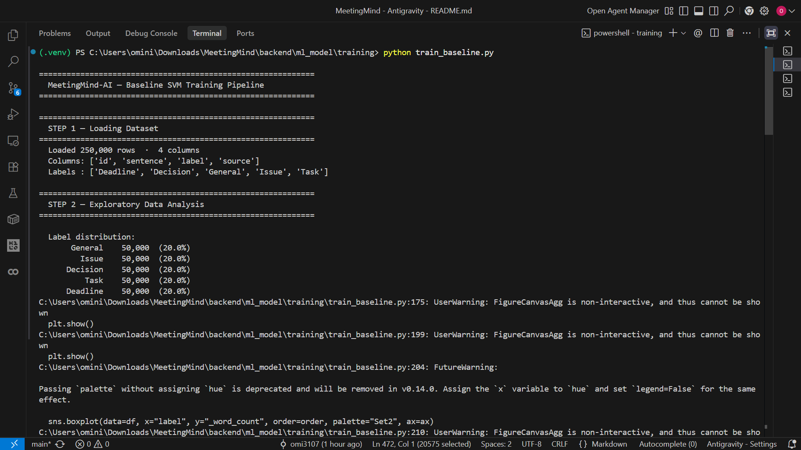
    </td>
    <td width="33%" align="center">
      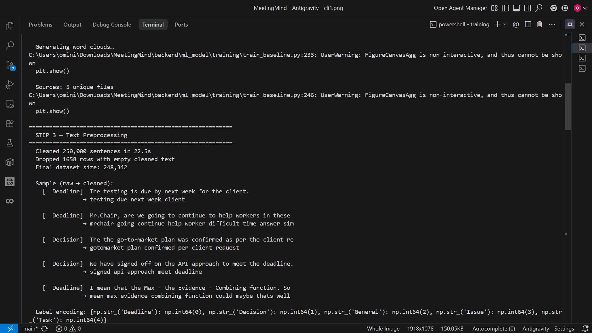
    </td>
    <td width="33%" align="center">
      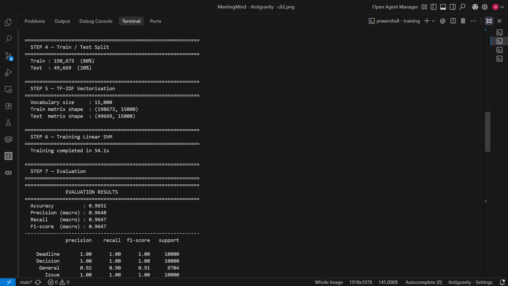
    </td>
  </tr>
  <tr>
    <td width="33%" align="center">
      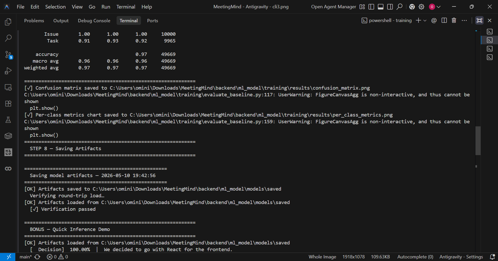
    </td>
    <td width="33%" align="center">
      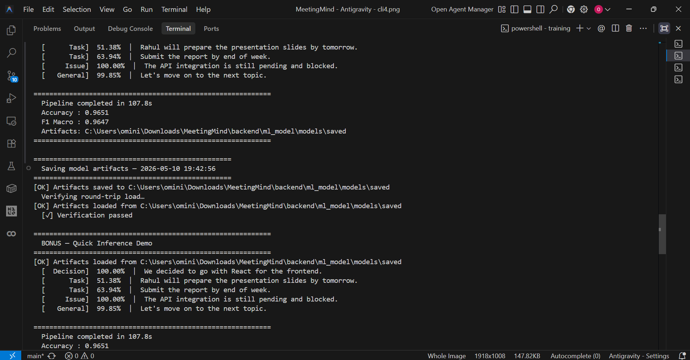
    </td>
    <td width="33%" align="center">
      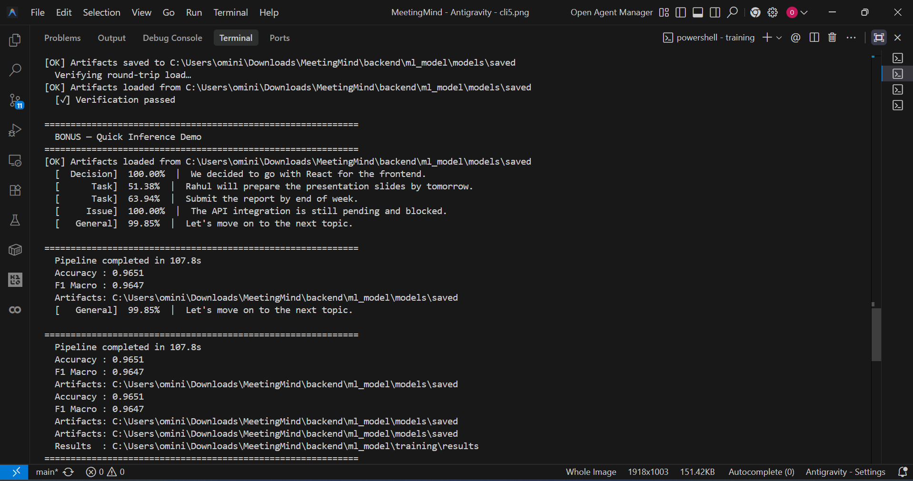
    </td>
  </tr>
</table>

---

## 9. AI Framing Layer

### Purpose
Transforms raw ML-classified output into clean, professional, display-ready content using LLMs.

### Provider Priority
1. **Gemini** (primary) — `gemini-2.0-flash`
2. **Groq** (fallback) — `llama-3.3-70b-versatile`, temperature 0.3 
3. **Basic formatting** (last resort) — Returns raw ML output without refinement

### Capabilities
- Refines ML bullet points into clean, concise sentences
- Extracts participant names from transcript context
- Maps responsibilities (participant → task assignments)
- Generates descriptive meeting title
- Calculates intelligence score (0–100) with assessment
- **Multilingual**: Generates all output in the user's selected language
- **AI Summary generation**: Separate function for executive summaries (also uses Groq → Gemini → fallback chain)

---

## 10. Data Flow

```
User uploads file or pastes text
        │
        ▼
Frontend sends file to POST /api/extract_text (if file)
        │
        ▼
Frontend sends text + language to POST /api/analyse
        │
        ▼
Backend: insight_extractor.extract_insights(text)
  ├─ NLTK sent_tokenize → sentence list
  ├─ text_cleaner.clean_text() → cleaned sentences
  ├─ TF-IDF vectorizer → sparse feature matrix
  ├─ SVM classifier → predicted labels + confidence
  └─ Returns structured dict with grouped insights
        │
        ▼
Backend: gemini_layer.refine_insights(raw, language)
  ├─ Builds structured prompt with ML output + transcript snippet
  ├─ Tries Groq → Gemini → Fallback
  └─ Returns refined JSON (title, participants, decisions, tasks, etc.)
        │
        ▼
Backend: _build_response() merges ML + AI results
        │
        ▼
Frontend receives JSON → renders dashboard
  ├─ Updates category panels (decisions, tasks, issues, etc.)
  ├─ Draws confidence graph
  ├─ Shows tags and intelligence score
  ├─ Saves to localStorage (meetingmind_history)
  └─ Auto-exports to Notion (if enabled)
```

---

## 11. External Integrations

### Notion Export

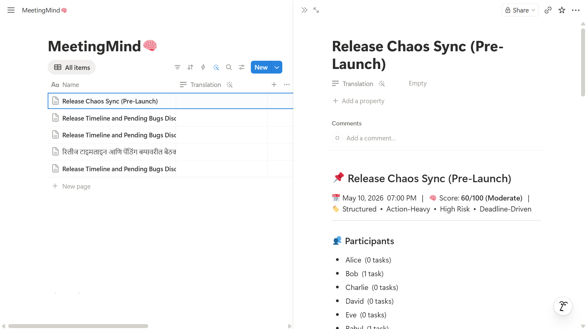

- **Module**: `backend/api/notion_export.py`
- Creates formatted Notion pages with headings, tables, bullet lists, callouts, and dividers
- Supports automatic export on analysis completion (toggle in Settings)
- Handles Notion's 100-block-per-request limit with batch appending
- **Endpoints**: `POST /api/export_notion`, `GET /api/notion_status`

### Google Translate
- Frontend embeds the Google Translate widget for full UI translation
- CSS overrides hide the default Google Translate banner to maintain UI aesthetics
- Separate from the backend language support (which generates AI content natively in the target language)

---

## 12. Configuration & Environment

### Environment Variables (`.env`)
| Variable | Purpose |
|----------|---------|
| `GEMINI_API_KEY` | Google Gemini API key |
| `GROQ_API_KEY` | Groq API key |
| `NOTION_API_KEY` | Notion integration token |
| `NOTION_DATABASE_ID` | Target Notion database ID |

### Central Config (`config.py`)
- Label set: `DECISION`, `ACTION_ITEM`, `DEADLINE`, `DISCUSSION`, `OTHER`
- TF-IDF max features: 5,000 (config default; vectorizer uses 15,000)
- Upload: Max 10 MB; PDF, DOC, DOCX, TXT supported
- spaCy model: `en_core_web_sm`
- Transformer settings: DistilBERT (reserved for future DL model)

---

## 13. How to Run

### Prerequisites
- Python 3.10+
- Trained ML model artifacts in `backend/ml_model/models/saved/`

### Installation
```bash
pip install -r requirements.txt
```

### Start the Backend (FastAPI)
```bash
python -m uvicorn backend.api.analysis_server:app --port 8502 --reload
```

### Start the Frontend (Streamlit)
```bash
streamlit run app.py
```
---

*Last updated: May 2026*
